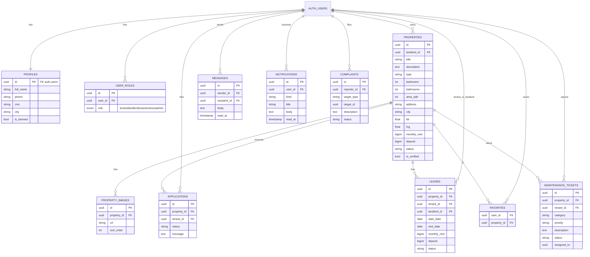

# ERD

```mermaid
erDiagram
  AUTH_USERS ||--|| PROFILES : has
  AUTH_USERS ||--o{ USER_ROLES : has
  AUTH_USERS ||--o{ PROPERTIES : owns
  AUTH_USERS ||--o{ APPLICATIONS : files
  AUTH_USERS ||--o{ LEASES : tenant_or_landlord
  AUTH_USERS ||--o{ FAVORITES : saves
  AUTH_USERS ||--o{ MAINTENANCE_TICKETS : reports
  AUTH_USERS ||--o{ MESSAGES : sends
  AUTH_USERS ||--o{ NOTIFICATIONS : receives
  AUTH_USERS ||--o{ COMPLAINTS : files

  PROPERTIES ||--o{ PROPERTY_IMAGES : has
  PROPERTIES ||--o{ APPLICATIONS : receives
  PROPERTIES ||--o{ LEASES : has
  PROPERTIES ||--o{ FAVORITES : in
  PROPERTIES ||--o{ MAINTENANCE_TICKETS : about

  PROFILES { uuid id PK "FK auth.users" string full_name string phone string cnic string city bool is_banned }
  USER_ROLES { uuid id PK uuid user_id FK enum role "tenant|landlord|maintenance|admin" }
  PROPERTIES { uuid id PK uuid landlord_id FK string title text description string type int bedrooms int bathrooms int area_sqft string address string city float lat float lng bigint monthly_rent bigint deposit string status bool is_verified }
  PROPERTY_IMAGES { uuid id PK uuid property_id FK string url int sort_order }
  FAVORITES { uuid user_id FK uuid property_id FK }
  APPLICATIONS { uuid id PK uuid property_id FK uuid tenant_id FK string status text message }
  LEASES { uuid id PK uuid property_id FK uuid tenant_id FK uuid landlord_id FK date start_date date end_date bigint monthly_rent bigint deposit string status }
  MAINTENANCE_TICKETS { uuid id PK uuid property_id FK uuid tenant_id FK string category string priority text description string status uuid assigned_to }
  COMPLAINTS { uuid id PK uuid reporter_id FK string target_type uuid target_id text description string status }
  MESSAGES { uuid id PK uuid sender_id FK uuid recipient_id FK text body timestamp read_at }
  NOTIFICATIONS { uuid id PK uuid user_id FK string kind string title text body timestamp read_at }
```
