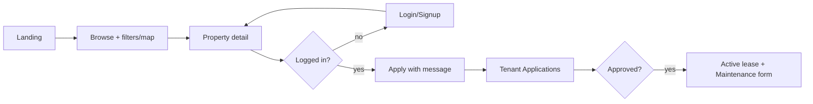
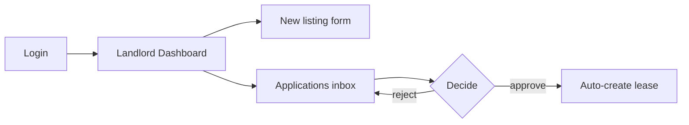
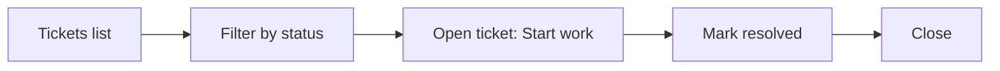
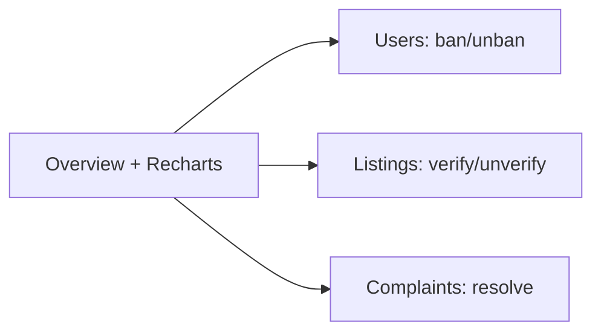

# User flows

## Tenant

```mermaid
flowchart LR
  A[Landing] --> B[Browse + filters/map]
  B --> C[Property detail]
  C --> D{Logged in?}
  D -- no --> L[Login/Signup] --> C
  D -- yes --> E[Apply with message]
  E --> F[Tenant Applications]
  F --> G{Approved?}
  G -- yes --> H[Active lease + Maintenance form]
```

## Landlord

```mermaid
flowchart LR
  A[Login] --> B[Landlord Dashboard]
  B --> C[New listing form]
  B --> D[Applications inbox]
  D --> E{Decide}
  E -- approve --> F[Auto-create lease]
  E -- reject --> D
```

## Maintenance

```mermaid
flowchart LR
  A[Tickets list] --> B[Filter by status]
  B --> C[Open ticket: Start work]
  C --> D[Mark resolved]
  D --> E[Close]
```

## Admin

```mermaid
flowchart LR
  A[Overview + Recharts] --> B[Users: ban/unban]
  A --> C[Listings: verify/unverify]
  A --> D[Complaints: resolve]
```
